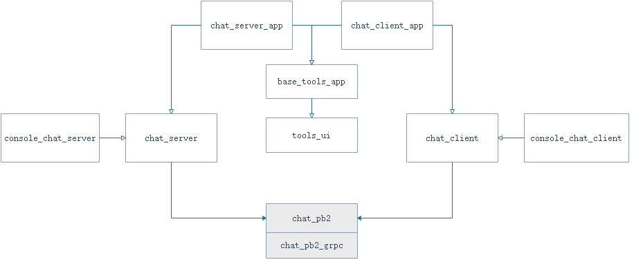

## Python gRPC Chat
Chat application created with gRPC. This was a study for bidirectional gRPC streaming.

## 程序结构

## 功能说明
+ 支持控制台聊天；
+ 支持pyqt5 ui聊天；
+ 支持心跳检测；
+ 支持服务端向客户端推送消息
+ 支持lru消息获取

## 运行程序方法

+ 使用界面ui: 
	python chat_server_app.py
	python chat_client_app.py

+ 使用控制台程序：
	python console_chat_server.py
	python console_chat_client.py

## 参考
+ [tcp_udp_web_tools](https://github.com/Wangler2333/tcp_udp_web_tools-pyqt5)
+ [grpc-hearbeat](https://gitee.com/liudegui/grpc-hearbeat)
+ [python-grpc-chat](https://github.com/melledijkstra/python-grpc-chat)
+ [py-grpc-chat-example](https://github.com/stallion5632/py-grpc-chat-example)

